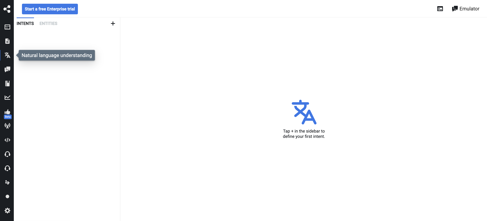

---------------

Natural Language Understanding (NLU) is a branch of artificial intelligence where computer understands and interprets the content gathered from a user. In fact, it transforms a natural dialog into structured information that your chatbot can understand and use to return the best answer possible.

The information generated by NLU tasks is added to the message metadata directly (under `event.nlu`), ready to be used by other modules and components.

:::note
If you want your bot to understand a question and provide an answer automatically, you should do it in the Q&A module instead.
:::

**Advantages:**
- fast speed (both at training and evaluation time);
- tight security (doesn't relay messages to external services);
- predictable (unit tests, and the model resides on your computer or server);
- free!

## NLU Tasks

### Intent Recognition

It’s about recognizing what the user is saying and training the chatbot to understand it.

### Entity Extraction

Entity extraction involves extracting structured information from messages like dates, time, cities, names, and many more. We generally define entities in the form of patterns or lists.

### Slot Tagging

Slot tagging is needed to identify the necessary parameters to fulfill a given task.

## Language Identification

Language identification is the ability to identify in which language the user is writing. In Botpress, you have many predefined language modules and the possibility to add your language model or use a third-party software to do auto-translations.

:::note
The best way to identify a language is by asking the user.
:::

## Language Server

The language server provides additional information about words. You don't have to teach your chatbot to understand synonyms. 

By default, your Botpress server queries one of our language servers, but you can host your server to keep it your premises.

## External NLU Providers

If you want to use an external provider for some reason, you can do so by using Hooks and calling the external NLU provider via API.

:::note
We don't support [(see why)](https://github.com/botpress/botpress/pull/1170) for two-way synchronization. You'll have to maintain this yourself.
:::